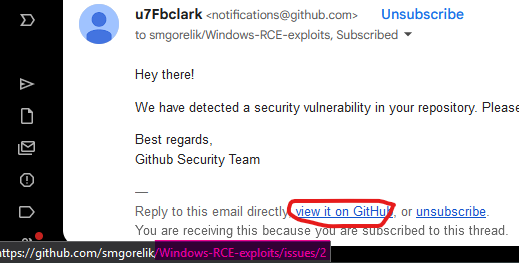
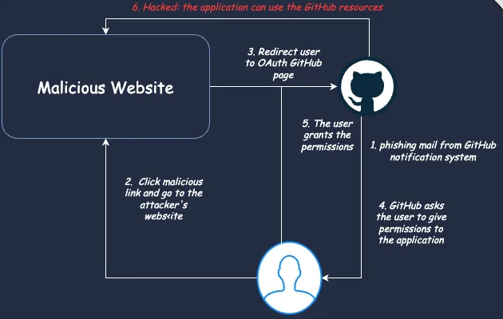
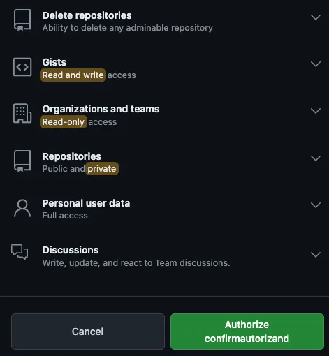

# Introduction
This morning, I received a phishing notification disguised as a GitHub alert. In this short blog post, I want to share the techniques the attackers used and explain why it can be difficult to recognize such phishing attempts.

## Email

In the image above, the first thing that caught my eye was the random name **u7Fbclark**, which made me stop before clicking the URL. Firstly, I checked the SPF and DKIM records to ensure that the email was coming from GitHub, and it was indeed from them.
In the image below, you can see that both SPF and DKIM checks passed.

The context of the email seemed perfectly normal for the following reasons.
First of all, I am subscribed to the smgorelik/Windows-RCE-exploits repository, which is legitimate and familiar to me. Secondly, there are known vulnerabilities in the repository, making it normal for GitHub to trigger alerts.
The main part of the email, the URL github-scanner[.]com, seems quite real. However, before clicking, I decided to check it.

> Please, everyone, do not click on everything. Zero-day vulnerabilities are real, and you should be especially careful if you are a power user!

## URL
Firstly, I decided to check the domain and performed a WHOIS query. After that, I was fairly certain it was phishing, as the domain information contained several red flags indicating it was a malicious URL.
In the image below, you can see the creation time of the domain, which was very recent. This was a key indicator for me that it was a malicious domain. Additionally, the registrant country was Malaysia.

I was curious about what the website looked like, so I used https://urlscan.io/. The first page I encountered was a CAPTCHA. Advanced attackers cleverly use CAPTCHAs to evade detection by security tools and bypass mechanisms like mail security gateways.

Of course, I finally checked on VirusTotal, and it was already flagged as malicious. **During my analysis in the morning, there was much less detection coverage.**

## The kill chain
I mentioned in the issue how I received the notification along with the adversary's comment. Unfortunately, the GitHub issue was removed, and I do not have a screenshot.

As I read, adversaries leverage OAuth app authorization to gain access to your GitHub account. The attacker attempts to gain privileges on your GitHub account by exploiting the OAuth mechanism, which allows external applications to access resources on behalf of the user. While this approach is useful for integrating external systems with applications, it can be quite dangerous if the external system is not trusted, as is the case here.

